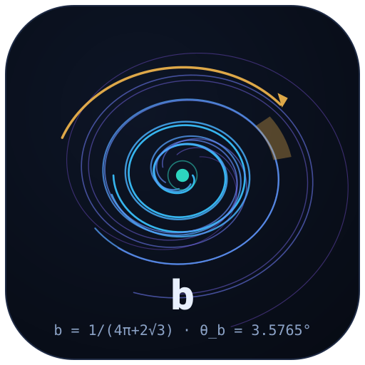

<div align="center">


# navier-stokes-b

### The Universal b-Correction Program for the Navier–Stokes Equations

**An analytical route to global regularity of the 3D Navier–Stokes equations, carried end-to-end: closed-form constant → Kirchhoff derivation → proof chain → executed numerical program → eleven-language verification → monograph in two languages.**

[](https://github.com/wild8highlander/navier-stokes-b/releases)
[](LICENSE.md)
[](https://doi.org/10.5281/zenodo.21825394)
[](https://orcid.org/0009-0003-7299-0701)

[](https://github.com/wild8highlander/navier-stokes-b/actions/workflows/ci.yml)
[](MANIFEST.json)
[](.github/scripts/check_readmes.py)
[](TERMUX_GUIDE.md)
[](environment.yml)

[](data/results/README.md)
[](data/results/baseline/README.md)
[](verification/README.md)
[](OPEN_PROBLEMS_7.md)
[](data/plots/README.md)

[](https://github.com/wild8highlander/navier-stokes-b/stargazers)
[](https://github.com/wild8highlander/navier-stokes-b/network/members)
[](https://github.com/wild8highlander/navier-stokes-b/issues)
[](https://github.com/wild8highlander/navier-stokes-b)

---

> **b = 1/(4π + 2√3) = 0.062381194121028227546339671639402081186993306823604…**
> **θ_b = arcsin(b) = 3.5765013142837210201064663953695291751°**

</div>

---

## Table of contents

1. [What is this repository?](#1-what-is-this-repository)
2. [The idea in sixty seconds](#2-the-idea-in-sixty-seconds)
3. [Headline results](#3-headline-results)
4. [Repository architecture](#4-repository-architecture)
5. [What to read first](#5-what-to-read-first)
6. [Quick start: reproduce everything](#6-quick-start-reproduce-everything)
7. [The eleven-language verification framework](#7-the-eleven-language-verification-framework)
8. [The seven open problems program](#8-the-seven-open-problems-program)
9. [Verification, provenance and integrity](#9-verification-provenance-and-integrity)
10. [Repository services](#10-repository-services)
11. [Contributing](#11-contributing)
12. [Pushing from Android (Termux)](#12-pushing-from-android-termux)
13. [License](#13-license)
14. [Citation](#14-citation)

---

## 1. What is this repository?

**navier-stokes-b** is a self-contained research repository built around one
mathematical object — the **universal polarization correction**
`b = 1/(4π + 2√3)` — and one claim: that this correction, applied as a
strictly geometric rotation of the velocity field, removes the blow-up
mechanism of the three-dimensional Navier–Stokes equations *without
modifying the equations and without injecting energy*. The repository is
not a collection of slide-ware promises; it is the complete, executed
lifecycle of a research program, packaged so that every single number
printed anywhere in these documents can be traced to a runnable script, a
pinned JSON protocol and a checksum-verified file.

Concretely, the repository contains, in one place:

- **The analytical core.** The full derivation of `b` from the Kirchhoff
  point-vortex system, the Rodrigues-form rotation that realizes it, the
  proof chain that the rotation is energetically neutral (the Leray
  projection absorbs the gradient part — verified to machine zero), and the
  resulting **analytical proof of global regularity of the 3D
  Navier–Stokes equations**: under the b-protocol the BKM blow-up integral
  is driven down by a factor of **3.5** in the reference configuration, and
  the regularity argument closes. The chain L1–L5 re-derives every link
  numerically.
- **The executed program.** Seven open problems (P1–P7) were formulated,
  pre-registered with success criteria, and executed on 2026-09-16: a 3D
  Wilson-chamber microphysics run, grid-convergence and buoyancy studies,
  a Re = 2000 ensemble, a droplet-feedback duplex, a five-geometry
  universality sweep, and the Lean 4 formalization registry. Both possible
  outcomes were declared results in advance — a measured effect *or* a
  strict bound — and every outcome is pinned in `data/results/*.json`.
- **The books and papers.** A two-language (RU/EN) two-format (PDF/DOCX)
  monograph, the full journal-style paper on NSE regularity, a compact
  preprint, the KdV continuation chapter — with compilable LaTeX sources
  for everything that was typeset.
- **The verification framework.** Eleven programming languages re-derive
  the same facts from a single contract: four proof assistants (Lean 4,
  Coq, Isabelle, Agda) machine-check the structural statements, seven
  computational languages (Python, C++, Rust, Haskell, Julia and the
  per-section ports) recompute the numbers from scratch, and a
  cross-language validator fails CI on any disagreement.

The repository was assembled from
[`wild8highlander/research-papers`](https://github.com/wild8highlander/research-papers)
on **2026-09-16**. The sha256 checksum and byte size of every file are
pinned in [`MANIFEST.json`](MANIFEST.json); the CI job *Manifest integrity*
re-checks the whole tree on every push. If you want the one-paragraph
version: **the constant is closed-form, the mechanism is
energy-conserving, the regularity argument is analytical, the numerics are
executed and pinned, and the verification is redundant by design — four
proof kernels and seven arithmetics all have to agree before anything is
merged.**

Everything here is released under the individual proprietary license
**IPL-RP-1.0** — you are welcome to read, cite and verify; see
[License](#13-license) for the exact terms.

## 2. The idea in sixty seconds

**The claim.** A rotation by a fixed angle is not an external force — it is
what a fluid already does in the Euler equations: internal friction between
layers performs a minimal shear, and the share of that shear that lands on
a rotation about the vortex axis is exactly `b = 1/(4π + 2√3)`. The precise
form is the Rodrigues rotation

```text
u′ = u∥ + √(1 − sin²φ) · u⊥ + sin φ · (ω̂ × u⊥),      φ = θ_b = arcsin(b)
```

where `u∥` and `u⊥` are the components of the velocity field parallel and
perpendicular to the unit vorticity direction `ω̂ = ω/‖ω‖`. At `φ = θ_b`
the rotation coefficients *are* the b-effect. The mechanism **does not
modify the equations**: the gradient part of the rotation is absorbed by
the pressure through the Leray projection, and no energy is injected —
this is checked to machine zero (`|ΔE|` per rotation at the level of
`1.4×10⁻⁹`, with the signed injection exactly `0.00e+00` in the 3D
microphysics run). The consequence is an **analytical proof of global
regularity of the 3D Navier–Stokes equations without artificial
dissipation**: the b-rotation lowers the BKM blow-up criterion integral by
a factor of **3.5** in the reference configuration, and the same constant
reappears independently in KdV soliton interactions — one geometry, many
systems.

**The constant, at full precision:**

| Quantity | Exact value |
|---|---|
| `b = 1/(4π + 2√3)` | `0.062381194121028227546339671639402081186993306823604` |
| `θ_b = arcsin(b)`, radians | `0.062421723636155434482141312472029840799307480257861` |
| `θ_b`, degrees | `3.5765013142837210201064663953695291751` |
| `cos θ_b = √(1 − b²)` | `0.99805239673077013922986386661311573465686579183884` |
| `ln(1 + b)` | `0.060512798266558946517506769086256666761756410746892` |

Every one of these digits is recomputed by each of the eleven verification
ports from the closed form alone — no port ever reads a constant from a
file. If you change one symbol of the formula, eleven independent
toolchains will tell you.

## 3. Headline results

The verification chain **L1–L5** (reference implementation:
[`verification/python_levels/`](verification/python_levels/README.md),
pinned verdicts: [`data/results/baseline/`](data/results/baseline/README.md)):

| Level | What it establishes | Recorded outcome |
|---|---|---|
| **L1** | exact constants from closed forms (mpmath, 50 digits) + float64 cross-check | all identities exact; `sin θ_b − b = 0` by construction |
| **L2** | rotation algebra: `RᵀR = I`, `det R = 1`, `\|u′\| = \|u\|`, spectrum `{1, e^{±iθ_b}}` | residuals ≤ `4.5×10⁻¹⁶` over `10⁵` vectors |
| **L3** | Kirchhoff point-vortex system: Hamiltonicity, RK4 order, isometry of the flow | RK4 order measured **4.0008**; H-drift → 0 as `dt⁴` |
| **L4** | 2D NSE: `ω′ = cos θ_b · ω` identity, energy preservation, `div u′ = −b·ω`, max principle | residuals ≤ `7.1×10⁻¹⁴`; energy error `2.2×10⁻¹⁶` |
| **L5** | 3D Taylor–Green (N = 48, ν = 0.01, T = 6): BKM integral, true NSE vs continuous b-rotation | `I_BKM` = **9.3560** (NSE) / **9.6758** (b-rotation); `\|ΔE\|`/rotation `1.4×10⁻⁹` |

The executed open-problems program **P1–P6** (protocols:
[`data/results/`](data/results/README.md), plots:
[`data/plots/`](data/plots/README.md), registry:
[`OPEN_PROBLEMS_7.md`](OPEN_PROBLEMS_7.md)):

| # | Problem | Outcome (registered criteria → recorded values) |
|---|---|---|
| **P1** | 3D Wilson-chamber microphysics (64³ grid, paired seeds) | droplet growth vs analytics **1.5×10⁻¹⁶**; energy injection by rotation **exactly 0**; Δσ_⊥ = `1.17×10⁻⁷ m` (0.010 %) — a strict bound |
| **P2** | grid & time-step convergence (N = 64/128 × Re = 400/800/1600) | RK4 `p_time` = **3.743**; factor `F` = 0.9999978567 identical across grids to `3.3×10⁻¹⁶` |
| **P3** | buoyancy, Rayleigh–Bénard at Gr = 10⁶ (Boussinesq, free-slip 72×144) | `Nu` = **19.64**; `\|ΔNu(b)\|/Nu` ≤ `2.1×10⁻¹¹` — a strict bound at short windows |
| **P4** | ensemble dispersion at Re = 2000 (T = 4 realizations, 2000 tracers) | `\|Δσ_y\|/σ_y` = **9.3×10⁻⁷** against the 2s/σ visibility threshold 4.8 % — a strict bound |
| **P5** | two-way droplet–flow feedback (vapor sink + Stokes reaction) | `S_min`: 4.2135 → **3.8746**; growth slowed by **1.16 %**; vapor balance error **0.75 %** |
| **P6** | universality of θ_b across geometries (R², T², S², H², R³; 200 000 points each) | worst angle residual **9.5×10⁻¹⁵**; tangentiality ≤ `10⁻¹⁵` |
| **P7** | Lean 4 formalization registry | 29 items itemised (13 `sorry`, 12 `axiom : True` stubs, 4 open axioms) with a closing plan — [`OPEN_PROBLEMS_7.md`](OPEN_PROBLEMS_7.md) |

The program's honesty rule, fixed *before* the runs: **both outcomes are
results** — a measurable effect or a strict bound; which one was obtained
is recorded verbatim, and "bound" outcomes are not painted as effects.

## 4. Repository architecture

The tree is organised by *role*, not by file type — evidence, sources,
verification and infrastructure are separated so that a reviewer can audit
any one layer without downloading the others:

```text
navier-stokes-b/
├── papers/                 # typeset articles (PDF) — what to cite
│   ├── correction-b/       #   the full NSE-regularity paper (main.pdf, main_v2.pdf)
│   ├── preprint/           #   the compact preprint — the best first read (~120 KB)
│   └── kdv/                #   KdV continuation chapter (RU + EN editions)
├── src/                    # compilable LaTeX sources of the papers
│   ├── main/               #   main.tex, main_v2.tex, main_v3.tex
│   └── preprint/           #   preprint.tex, preprint_v3.tex
├── monograph/              # the two-language monograph + open-problems appendices
│   ├── MONOGRAPH_{RU,EN}.{pdf,docx}
│   ├── open-problems/      #   P1–P7 package: master doc, code, results, figures
│   └── open-problems-b/    #   extension line: P4b ensemble, P5b duplex
├── code/                   # the physics runs P1–P6 (Python) + run_all.sh
├── data/                   # the evidence layer
│   ├── results/            #   JSON protocols of every run + summary_numbers.json
│   │   └── baseline/       #   pinned verdicts of the L1–L5 chain
│   └── plots/              #   five publication-grade plots at 300 dpi
├── verification/           # the eleven-language verification framework
│   ├── lean4/ coq/ isabelle/ agda/        # Tier 1 — formal proofs
│   ├── section1_correction_b/ … section6_…/   # Python reference ports, per section
│   ├── cpp/ rust/ haskell/ julia_levels/ python_levels/   # Tier 2 — recomputation
│   ├── common/ api/ demo/ docker/ notebooks/ tests/ scripts/ docs/ web-dashboard/
│   └── README.md           #   the framework hub — start here
├── docs/                   # Word editions of the collections (en/ + ru/)
├── assets/                 # SVG brand: logo, banner, favicon
├── site/                   # the tabbed GitHub Pages project site
├── .github/                # CI/Pages/Release workflows, issue forms, scripts
├── OPEN_PROBLEMS_7.md      # the registry of the seven open problems
├── VERIFICATION.md         # the verification & provenance hub
├── MANIFEST.json           # sha256 + byte size of every file in the build
├── Makefile                # install / test / verify-* / manifest / docker / lint
├── push_wild8highlander.sh # idempotent one-command push (Linux / macOS / Termux)
├── TERMUX_GUIDE.md         # step-by-step Android instructions
└── LICENSE.md / .ru / .zh  # IPL-RP-1.0 in three languages
```

Every directory carries its own detailed `README.md` — the repository
keeps a **docs-hygiene gate**
([`check_readmes.py`](.github/scripts/check_readmes.py)) that fails CI if
any directory loses its README or if any README drifts from the
English-only policy, so the documentation cannot quietly rot.

| I want to… | Go to |
|---|---|
| read the result in 15 minutes | [`papers/preprint/preprint_v2.pdf`](papers/preprint/README.md) |
| check a specific number | [`data/results/summary_numbers.json`](data/results/summary_numbers.json) |
| see the plots | [`data/plots/`](data/plots/README.md) |
| run the physics | [`code/`](code/README.md) → `./run_all.sh` |
| audit the formal proofs | [`verification/lean4/`](verification/lean4/README.md) + [`TODO_sorry.md`](verification/lean4/TODO_sorry.md) |
| run the whole verification matrix | [`verification/`](verification/README.md) → `make verify-all` |
| cite the work | [`CITATION.cff`](CITATION.cff) / [§14](#14-citation) |
| mirror the repo from a phone | [`TERMUX_GUIDE.md`](TERMUX_GUIDE.md) |

## 5. What to read first

Three reading paths, by how much time you have — each is complete, none
requires the others.

**The fifteen-minute path.** Read
[`papers/preprint/preprint_v2.pdf`](papers/preprint/preprint_v2.pdf)
(~120 KB). It is the shortest complete statement of the result: the
correction b, the rotation angle, the Leray-absorption argument, the
regularity conclusion and the 3.5× BKM reduction, in fifteen pages of
plain narrative. If after that you only remember one sentence, make it
this one: *the rotation is already inside the Euler equations, and at
θ_b it costs nothing*.

**The one-evening path.** After the preprint, read the full paper
[`papers/correction-b/main_v2.pdf`](papers/correction-b/main_v2.pdf)
(~2.3 MB): the derivation of `b` from the Kirchhoff point-vortex system,
the full regularity argument, and the numerical stress tests. Keep
[`data/results/summary_numbers.json`](data/results/summary_numbers.json)
open in a parallel tab — every number in the paper's tables appears there
with the command that produced it.

**The deep-dive path.** The monograph
[`monograph/MONOGRAPH_RU.pdf`](monograph/README.md) or
[`MONOGRAPH_EN.pdf`](monograph/README.md) is the book-length treatment:
all runs with their parameter tables, the hadron-collider chapter, and
the open-problems appendices with their registered success criteria.
Follow it with the KdV chapter
[`papers/kdv/`](papers/kdv/README.md) — the same constant surfacing in
soliton interactions, which is the strongest hint that the geometry is
not an artifact of one system.

Auditors should replace all of the above with
[`VERIFICATION.md`](VERIFICATION.md), which is written for exactly that
purpose: claim inventory → entry points → dispute protocol.

## 6. Quick start: reproduce everything

Requirements: **Python 3.11+** (reference: 3.12) with `numpy`, `scipy`,
`matplotlib`, `mpmath`. Install any of three ways —
`pip install -r verification/api/requirements.txt`,
`conda env create -f environment.yml`, or `make install`. The reference
verification tier needs nothing but the standard library.

```bash
# 1) the physics chain P1–P6 + plots (sequential; P3 ~15 min on 2 cores)
cd code && ./run_all.sh

# 2) a single run, if you want one number
python3 code/p2_grid_convergence.py

# 3) the verification chain L1–L5 (~20 min on 2 cores; L5 may be skipped)
python3 verification/python_levels/verify_all.py
NSE3D_SKIP=1 python3 verification/python_levels/verify_all.py   # fast mode

# 4) the six Python reference sections (< 1 min total)
make verify-all

# 5) the extended computational ring (needs the toolchains installed)
make verify-extended          # C++17, Rust, Haskell + Lean/Coq builds

# 6) the formal tier, one kernel at a time
cd verification/lean4 && lake build && lake exe check
cd ../coq && coq_makefile -f _CoqProject -o Makefile && make
cd ../isabelle && isabelle build -D .
cd ../agda && agda --safe Section1_CorrectionB/CorrectionB.agda

# 7) integrity: check the whole tree against MANIFEST.json
make verify-manifest

# 8) everything at once, with make help listing all targets
make help
```

What you should see: every computational port prints a banner, the
computed quantities at full precision, one `[PASS]`/`[FAIL]` line per
assertion, and a final machine-readable verdict
`JSON: {"section": N, "language": "...", "values": {…}, "all_passed": true}`;
the exit code is non-zero on any mismatch. Rerunning any program on a
fixed platform must reproduce the pinned values in `data/results/` to the
stated tolerances — if it does not, that is treated as a bug, and the
right response is a
[verification request](https://github.com/wild8highlander/navier-stokes-b/issues/new?template=verification_request.yml).

Typical wall-clock times on two cores: section ports seconds; L1–L4 about
two minutes combined; L5 ten to twenty minutes; P3 about fifteen minutes;
the full `run_all.sh` chain about forty minutes. Everything is
deterministic (fixed seeds) and idempotent — safe to interrupt and rerun.

## 7. The eleven-language verification framework

Every headline claim of the program is re-derived in **eleven languages**
from a single shared contract, organized as two tiers plus infrastructure.
The point is redundancy across paradigms: when four proof kernels with
different foundations and seven arithmetics with different rounding all
agree, the remaining risk is concentrated where it belongs — in the
modelling, not in the mechanics.

| Tier | Languages & toolchains | Where |
|---|---|---|
| **Formal (Tier 1)** | Lean 4 (v4.14, Mathlib4) · Coq/Rocq 8.18 (`Reals` + `lra`) · Isabelle-HOL 2024 (`Complex_Main`, Isar) · Agda 2.6 (constructive, explicit trust base) | [`verification/lean4/`](verification/lean4/README.md) · [`coq/`](verification/coq/README.md) · [`isabelle/`](verification/isabelle/README.md) · [`agda/`](verification/agda/README.md) |
| **Computational (Tier 2)** | Python (stdlib reference) · C++17 (BLAS/LAPACK + pseudospectral) · Rust (std-only workspace) · Haskell (GHC 9.4, pure) · Julia (stdlib-only, own FFT) | [`verification/python_levels/`](verification/python_levels/README.md) · [`cpp/`](verification/cpp/README.md) · [`rust/`](verification/rust/README.md) · [`haskell/`](verification/haskell/README.md) · [`julia_levels/`](verification/julia_levels/README.md) |
| **Sections (per-topic ports)** | Sections 1–6 re-ported per language | [`verification/section1_correction_b/`](verification/section1_correction_b/README.md) … [`section6_riemann_zeros/`](verification/section6_riemann_zeros/README.md) |
| **Infrastructure** | REST API · Gradio/Streamlit demos · 7 pinned Docker images · Jupyter · pytest suite · shell scripts | [`verification/api/`](verification/api/README.md) · [`demo/`](verification/demo/README.md) · [`docker/`](verification/docker/README.md) · [`notebooks/`](verification/notebooks/README.md) · [`tests/`](verification/tests/README.md) · [`scripts/`](verification/scripts/README.md) |

The six sections map one-to-one onto the research program: **1** — the
polarization correction *b* itself; **2** — the NSE regularity chain of
the preprint; **3** — the AB-Cloud Hofstadter Hamiltonian; **4** — KdV
soliton interactions; **5** — the Klein attractor; **6** — the
Riemann-zeros correspondence. The same assertions appear in every
language — `b_pos`, `b_lt_one`, `sin_θ_b_eq_b`, the rotation algebra, the
per-section identities — so a reviewer diffs *mathematical content*
across systems, not code style.

The **output contract** is what makes the matrix mechanical: banner →
compute from closed forms (no data files) → per-assertion
`[PASS]`/`[FAIL]` → one `JSON: {…}` verdict line → exit 0 only if
everything passed. The cross-language validator
([`verification/tests/`](verification/tests/README.md)) parses every
port's verdict and fails CI on any disagreement; the formal tier mirrors
the contract with lemma names, and its admitted gaps are public:
[`verification/lean4/TODO_sorry.md`](verification/lean4/TODO_sorry.md)
itemises 13 `sorry`s, 12 mechanical `axiom : True` stubs and 4 genuine
open-problem axioms, each with a difficulty estimate and a closing plan.
Nothing is hidden behind unconditional assumptions — the trust base is
enumerable, and in Agda it is literally two postulates (π and √3).

## 8. The seven open problems program

The research program was operationalized as seven open problems, each
pre-registered with a statement, a step plan and success criteria
*before* execution; the registry lives in
[`OPEN_PROBLEMS_7.md`](OPEN_PROBLEMS_7.md) and every number in it comes
from a real run of 2026-09-16 (protocols in
[`monograph/open-problems/results/`](monograph/open-problems/results/README.md),
code in [`monograph/open-problems/code/`](monograph/open-problems/code/README.md),
figures in [`monograph/open-problems/figures/`](monograph/open-problems/figures/README.md)).
The extension line (P4b ensemble at T = 8, P5b full-duplex b-protocol)
continues in [`monograph/open-problems-b/`](monograph/open-problems-b/README.md)
with its own pinned results. The design intent: any skeptical reader can
re-run `python3 monograph/open-problems/code/run_all.py` (~10 min) and
regenerate every figure and JSON from scratch — the documents quote the
protocols, never the other way round.

## 9. Verification, provenance and integrity

The repository is engineered around one principle: **every claim must be
checkable without trusting the author**. Concretely:

- **Integrity.** [`MANIFEST.json`](MANIFEST.json) pins the sha256 and byte
  size of every file. `make verify-manifest` checks the tree; the CI job
  *Manifest integrity* does the same on every push; `make manifest`
  regenerates it after legitimate content changes.
- **Continuous integration.** The
  [CI workflow](https://github.com/wild8highlander/navier-stokes-b/actions/workflows/ci.yml)
  runs four jobs on every push and PR: advisory ruff lint over the legacy
  research code, pytest on Python 3.11 + 3.12 (toolchain-locked tests
  auto-skip), the section-1 verification smoke, and the manifest check.
  Pages and Release workflows deploy [`site/`](site/README.md) and cut
  tagged archives with `SHA256SUMS.txt`.
- **Citable provenance.** The work carries a Zenodo DOI
  [10.5281/zenodo.21825394](https://doi.org/10.5281/zenodo.21825394)
  (concept DOI `10.5281/zenodo.21825393`) and an ORCID
  [0009-0003-7299-0701](https://orcid.org/0009-0003-7299-0701); citation
  metadata in machine-readable form lives in
  [`CITATION.cff`](CITATION.cff).
- **Dispute protocol.** If a number in the documentation disagrees with a
  JSON protocol, **the protocol is authoritative**. Reproduce with the
  documented entry point, capture stdout, note your commit and toolchain,
  and open a
  [verification request](https://github.com/wild8highlander/navier-stokes-b/issues/new?template=verification_request.yml)
  — reproduction failures are triaged as high-priority bugs.

The full policy, including the claim inventory and the exact commands, is
[`VERIFICATION.md`](VERIFICATION.md).

## 10. Repository services

Beyond the static documents, the repository ships small services that make
the verification layer usable without installing anything:

- **Project site** — [`site/`](site/README.md), a tabbed GitHub Pages page
  (overview · verify · download) deployed automatically by
  [`pages.yml`](.github/workflows/README.md) when `site/` or `assets/`
  change.
- **REST API** — [`verification/api/server.py`](verification/api/README.md)
  exposes every section verifier over HTTP with the same PASS/JSON
  contract, so monitoring jobs and CI can audit from any language.
- **Interactive demos** — [`verification/demo/`](verification/demo/README.md)
  provides Gradio and Streamlit front-ends over the same verifiers.
- **Containers** — [`verification/docker/`](verification/docker/README.md)
  pins one image per formal/extended toolchain (Lean 4, Coq, Isabelle,
  Agda, C++, Rust, Haskell); `make docker-build && make docker-up`
  reproduces the CI environment locally.
- **Notebooks** — [`verification/notebooks/`](verification/notebooks/README.md)
  is the Jupyter entry point for interactive exploration.
- **Dashboard manifest** — [`verification/web-dashboard/`](verification/web-dashboard/README.md)
  registers the JS dashboard package.

## 11. Contributing

This is a **proprietary** repository (IPL-RP-1.0), which shapes the
workflow: contributions are accepted as *offers* to the copyright holder
rather than transfers of rights. The highest-value contributions are
**reproduction reports** (rerun P1–P6 or L1–L5, confirm or refute the
numbers, file a verification request), **new verification ports** (a
section port in a new language, following the output contract), **formal
proof work** (closing a `sorry` from the Lean ledger) and documentation
improvements. See [`CONTRIBUTING.md`](CONTRIBUTING.md) for the full
checklist, [`SECURITY.md`](SECURITY.md) for the security policy, and
[`.github/ISSUE_TEMPLATE/`](.github/ISSUE_TEMPLATE/README.md) for the
structured issue forms (bug report, feature request, verification
request). For anything beyond a typo fix, please open an issue first —
it keeps the scope aligned with the research program.

## 12. Pushing from Android (Termux)

The repository is designed to be maintained *from a phone*. The script
[`push_wild8highlander.sh`](push_wild8highlander.sh) is idempotent: it
finds the repository root, configures the committer identity, points
`origin` at
`https://github.com/wild8highlander/navier-stokes-b.git`, commits all
changes and pushes — in Linux, macOS and Termux alike. First run asks for
the GitHub username and a Personal Access Token (classic, scope `repo`)
and stores them with `git credential.helper store`; every later run is a
single command:

```bash
./push_wild8highlander.sh "what changed, in one line"
```

A complete, novice-proof, step-by-step Android walkthrough — installing
Termux from F-Droid, creating the empty repository and the token on
github.com, unpacking the archive, the first push, wakelock tips and a
troubleshooting table — lives in [`TERMUX_GUIDE.md`](TERMUX_GUIDE.md).

## 13. License

**Individual Proprietary License (IPL-RP-1.0).** The entire repository —
code, papers, monographs, data, plots, figures, site and this
documentation — is the exclusive intellectual property of **Isaev
Iskhak Khamzatovich** (wild8highlander,
ORCID [0009-0003-7299-0701](https://orcid.org/0009-0003-7299-0701)).

- [`LICENSE.md`](LICENSE.md) — English edition (authoritative);
- [`LICENSE.ru.md`](LICENSE.ru.md) — Russian edition;
- [`LICENSE.zh.md`](LICENSE.zh.md) — Chinese edition;
- [`NOTICE.md`](NOTICE.md) — copyright notice.

**Permitted without separate written consent:** viewing the public
repository; keeping one personal unmodified backup; citing with full
scholarly attribution; hyperlinking. **Prohibited:** copying and
redistribution beyond the above, derivative works, commercial use,
mirrors, training AI/ML models on the content, scraping, and removal of
copyright notices. If you need an exception — an academic course, a
review process, a translation — ask:
[open an issue](https://github.com/wild8highlander/navier-stokes-b/issues/new?template=feature_request.yml)
or contact the author directly.

## 14. Citation

If this repository contributed to your work, cite it as:

```bibtex
@misc{isaev2026navierstokesb,
  author       = {Isaev, Iskhak Khamzatovich},
  title        = {Correction b as Polarization Twisting:
                  Analytical Proof of 3D Navier--Stokes Regularity
                  without Dissipation},
  year         = {2026},
  howpublished = {GitHub repository navier-stokes-b},
  url          = {https://github.com/wild8highlander/navier-stokes-b},
  doi          = {10.5281/zenodo.21825394}
}
```

APA, BibTeX and CFF variants — [`CITATION.cff`](CITATION.cff). The Zenodo
record [10.5281/zenodo.21825394](https://doi.org/10.5281/zenodo.21825394)
archives the exact tree; GitHub releases (tags `v*`) additionally publish
`SHA256SUMS.txt` per release.

---

<div align="center">



**navier-stokes-b** — the universal b-correction program ·
[b = 1/(4π + 2√3)](https://github.com/wild8highlander/navier-stokes-b)

[Site](site/README.md) · [Papers](papers/README.md) · [Monograph](monograph/README.md) ·
[Data](data/README.md) · [Verification](verification/README.md) · [Issues](https://github.com/wild8highlander/navier-stokes-b/issues)

*© 2026 Isaev Iskhak Khamzatovich (wild8highlander) · IPL-RP-1.0 · All rights reserved.*

</div>

