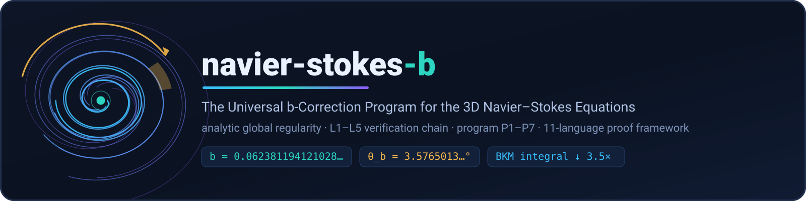

# `assets/` — Brand and Visual Assets

> **Navigation:** [repository root](../README.md) › **`assets`**


The SVG artwork of the project. The vortex mark encodes the essence of the
work: a velocity field winding into a vortex, the **amber sector marking
the b-correction rotation angle θ_b** on the outer orbit, and the amber
arrow showing the direction of the Rodrigues rotation — with **no energy
injected**. The palette matches the publication plots in
[`data/plots/`](../data/plots/README.md) (NSE baseline blue, b-protocol
amber), so the repository reads as one visual system from figure to
favicon.

| File | Purpose | Used by |
|---|---|---|
| [`logo.svg`](logo.svg) | square mark (512×512) | root README footer, GitHub social previews |
| [`banner.svg`](banner.svg) | hero banner (1600×400) | root README header, the Pages site header |
| [`favicon.svg`](favicon.svg) | compact mark (64×64) | [`site/`](../site/README.md) favicon |

## Design notes

The assets are plain, script-generated SVG (see `scripts/make_logo_svg.py`
in the author's toolchain): no raster layers, no embedded fonts, no
filters that render differently across viewers. They therefore look
identical in GitHub README `` tags, in the Pages site, and when
scaled from a 24-px tab icon to a poster. The amber angle sector is drawn
at exactly the arc θ_b = 3.5765° exaggerated for legibility — the
underlying geometry is the same Rodrigues construction the papers derive.

## Usage

Reference from markdown with a relative path — GitHub renders SVG inline:

```html

```

When editing, keep the files hand-diffable (one shape per line group) and
re-run the docs hygiene check (`make check-readmes`) plus the manifest
refresh (`make manifest`) in the same commit. The artwork is part of the
proprietary bundle ([IPL-RP-1.0](../LICENSE.md)) — reuse it only as the
license permits (quoting with attribution; no derivative marks).


## The geometry behind the mark

The logo is not decoration — it is the theorem, drawn. The winding field
lines depict a velocity field organizing into a vortex; the amber sector
on the outer orbit is the rotation angle θ_b = 3.5765° (exaggerated for
legibility, but placed exactly at the sector the Rodrigues construction
sweeps); the amber arrow shows the direction of the corrected rotation
`u′ = u∥ + √(1−b²)·u⊥ + b·(ω̂×u⊥)`. The deliberate absence of any
inflow/outflow asymmetry encodes the central claim: **no energy injected**
— the rotation rearranges, it does not add.

## Colour tokens

| Token | Hex | Used for |
|---|---|---|
| vortex blue | `#1284BA` | the NSE baseline branch, link accents |
| b-amber | `#FFB13B` | the b-protocol branch, the angle sector |
| deep ink | `#0B1F2A` | line work, text |
| pass green | `#2EA043` | verification-state accents |

These are the same tokens the publication plots use (blue baseline / amber
protocol), which is why a figure lifted from
[`data/plots/`](../data/plots/README.md) matches the banner without any
recolouring.

## Social previews

GitHub picks the social preview from the repository settings (uploads, not
files in the tree) — use `banner.svg` exported at 1280×640 for that. The
files here remain the source of truth; if the mark changes, the social
preview upload must be refreshed in the same change as the SVGs and the
manifest.

---

Navigation: [repository root](../README.md) · [project site](../site/README.md) · [plots](../data/plots/README.md) · [IPL-RP-1.0](../LICENSE.md)

*Part of [wild8highlander/navier-stokes-b](https://github.com/wild8highlander/navier-stokes-b) — © 2026 Isaev Iskhak Khamzatovich, all rights reserved.*
