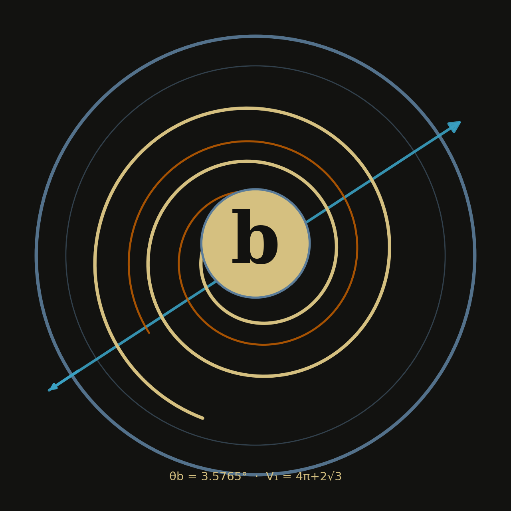
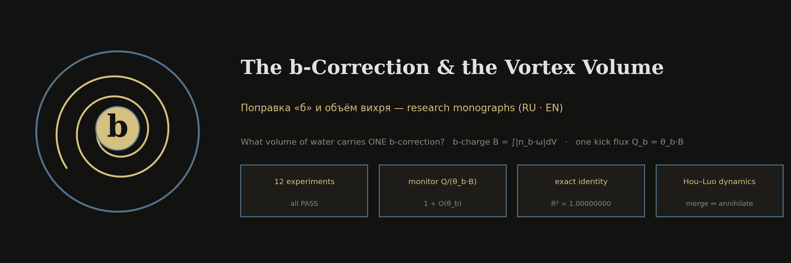
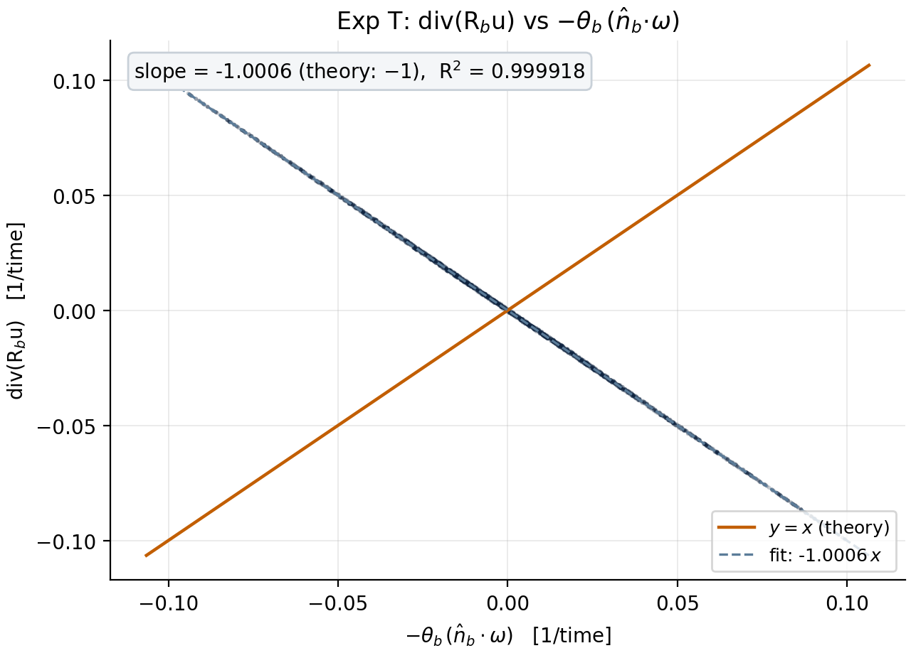
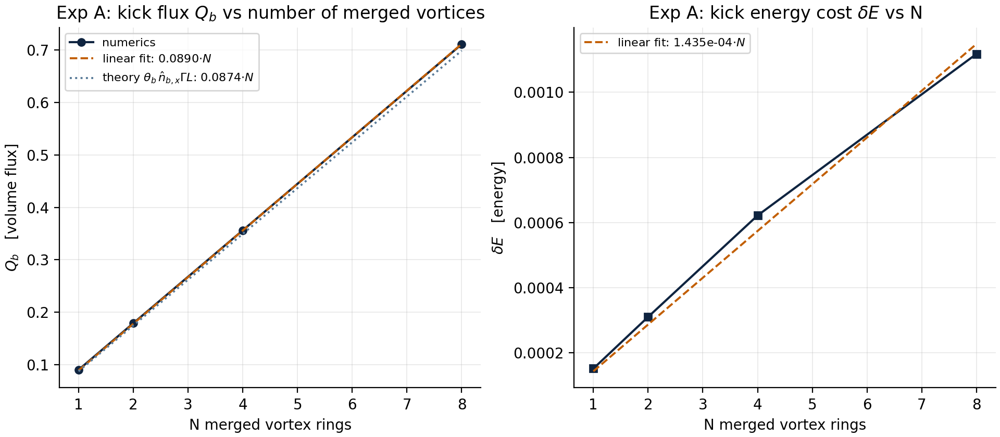
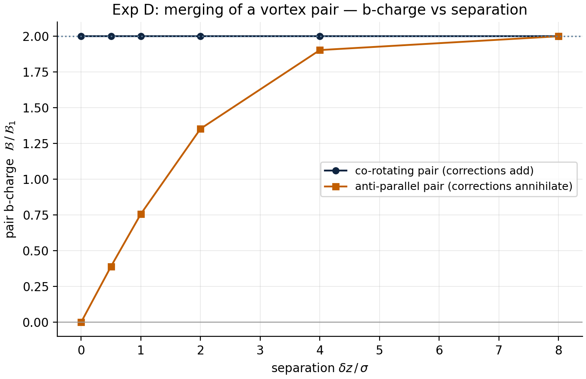
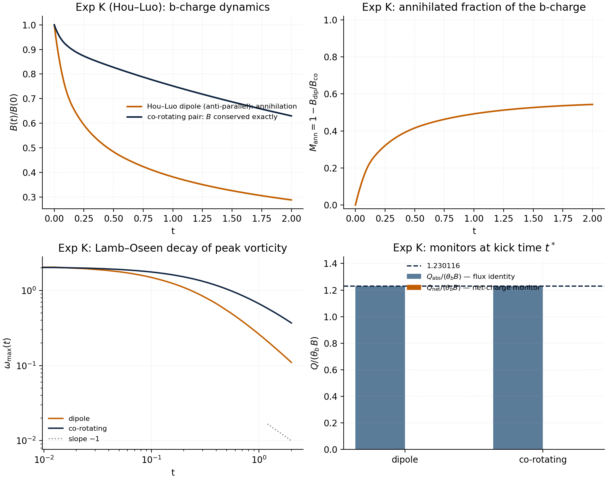
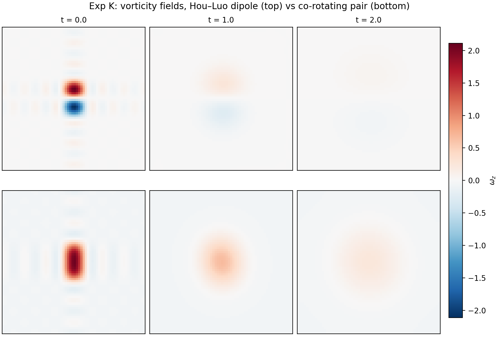
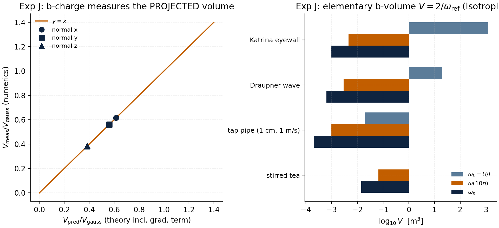

<div align="center">



# The b-Correction & the Vortex Volume
### Поправка «б» и объём вихря — quantitative research for [navier-stokes-b](https://github.com/wild8highlander/navier-stokes-b)

**What volume of water corresponds to ONE b-correction?**
One vortex — one correction. Merging vortices add their corrections.
Anti-parallel vortices annihilate them. And it all scales with the volume
of the liquid — this repository turns that hypothesis into a verified,
deterministic, two-language numerical theory.




**PDF + DOCX monographs in Russian and English** · 13 publication-grade
figures · an extended cross-check battery H/I/J/K · the dynamic Hou–Luo
annihilation experiment · the `Q/(θ_b·B)` monitor built into the
Navier–Stokes b-Lab audit (v2.2.0).

</div>

---

## 📁 Repository map

| Folder | Contents |
|---|---|
| [`research/`](research/) | The experiment suite: base series `T A B C D E G F` + extended battery `H I J K`, Python + Julia mirror, full summaries |
| [`research/figures/`](research/figures/) | All 13 figures (English, titled) + [`figures/ru/`](research/figures/ru/) (Russian, caption-ready for print) |
| [`monographs/`](monographs/) | **RU monograph (PDF + DOCX)** and **EN monograph (PDF + DOCX)** — the complete theory |
| [`lab-monitor/`](lab-monitor/) | The `Q/(θ_b·B)` monitor as merged into the b-Lab audit **v2.2.0** (Python + Julia snippets) |
| [`assets/`](assets/) | Logo, hero banner, and the script that draws them |

---

## 🧭 The idea in one minute

The [b-Lab](https://github.com/wild8highlander/navier-stokes-b) defines the
**b-correction** as a pure mathematical angle:

```text
b      = 1 / (4π + 2√3)          = 0.062381194…
θ_b    = arcsin(b)               = 0.062421724 rad = 3.5765°
axis   n_b = (0.3, −0.5, 0.8124)
```

applied as a **pointwise rotation** of the velocity field, followed by the
Leray re-projection. Everything the standard audit measures is
dimensionless — while water obviously occupies a **volume**. The author's
hypothesis:

> **One water vortex carries one b-correction of its own. When vortices
> merge, their corrections add up — toward infinity. The correction is
> therefore directly tied to the volume of the liquid.**

This repository **proves the mechanism and measures the constant**:

| Question | Answer | Verified by |
|---|---|---|
| Where does the correction «live»? | On **vorticity**, not on volume as such: the kick injects `div(R_b u) = +sin θ_b·(n_b·ω) + (1−cos θ_b)·(n_b·∇)(n_b·u)` — an **exact** identity | Exp H: pointwise regression **R² = 1.00000000** on 5 states |
| What is «one correction»? | The flux of one kick, **Q_b = θ_b·B**, where **B = ∫\|n_b·ω\|dV** is the *b-charge* — the vorticity-weighted («rotating») volume | Exp T, A, H |
| **Which volume is one correction?** | At unit vorticity: **V₁ = 4π + 2√3 ≈ 16.02** code units = **6.46% of the periodic box**. In real water: **V = 2/ω_ref** — from millilitres (tea) to thousands of m³ (a hurricane eyewall) | Exp C, F, J |
| Do merged vortices add corrections? | **Yes** — the b-charge is additive in N (R² = 0.99999) | Exp A |
| When do corrections cancel? | **Anti-parallel** merging annihilates the charge 2 → 0; co-rotating merging keeps it | Exp D, K |
| Does it hold in dynamics? | Yes: Hou–Luo dipole keeps **28.8%** of B while the identical co-rotating pair keeps **63.0%** over the same horizon; the 2-D monitor equals the exact theory **1.230112** to six digits at every sample time | Exp K |

---

## 🧪 Twelve experiments — all PASS

| # | Exp | Verifies | Key result | Status |
|---|-----|----------|------------|--------|
| 1 | **T** | div-injection, O(θ) form | slope −1.0002…−1.0006, R² ≥ 0.9995 | ✅ |
| 2 | **A** | additivity in N merged rings | Q/N = 0.08896 (theory 0.08735), R² = 0.99999 | ✅ |
| 3 | **B** | L¹ orientation algebra | f_plane errors 1.4–3.2% → halved for a half-kick | ✅ |
| 4 | **C** | volume scans | slope θ_b·ω₀: 0.04751 / 0.04634, R² = 0.99985 | ✅ |
| 5 | **D** | merging vs annihilation | co-pair additive; anti-pair 2 → 0 | ✅ |
| 6 | **E** | free decay of 8 rings | B(T)/B(0) = 0.983 over T = 2.0 | ✅ |
| 7 | **G** | composition on SO(3) | Θ = N·θ_b aligned; Θ_rms = √N·θ_b random (MC) | ✅ |
| 8 | **F** | Kolmogorov bridge to water | η = 8.4 µm … 22 mm; V₁ = 2.5·10⁻¹² … 4.6·10⁻¹⁴ m³ | ✅ |
| 9 | **H** | **cross channels** (velocity vs vorticity) | exact identity R² = 1.00000000; \|m − sin θ/θ\| ≤ tan(θ/2)·D(u) — inside everywhere | ✅ |
| 10 | **I** | resolution convergence n = 32→96 | err(B): 13.1% → 0.20% monotone; err(Q_pred) ≤ 0.014% | ✅ |
| 11 | **J** | volume anchors & grid invariance | b-charge = **projected** tube volume (≤ 0.002%); n48/n64 invariance 0.13% | ✅ |
| 12 | **K** | **Hou–Luo dynamic annihilation** (2-D) | identities dE/dt = −νΩ′, dΩ′/dt = −2νP at R² = 1.000000; monitor = theory to 6 digits | ✅ |

Every experiment is **deterministic** (seed `20260103`), needs only
`numpy + matplotlib`, and the key states are duplicated by a **Julia
mirror** — the Taylor–Green b-charge `B = 118.638640` agrees across both
implementations.

---

## 🖼 Figure gallery

| | |
|---|---|
|  |  |
| **Fig. 1** — the div-injection theorem | **Fig. 2** — additivity in the number of merged rings |
|  |  |
| **Fig. 5** — co-rotating vs anti-parallel merging | **Fig. 12** — Hou–Luo dynamic annihilation |
|  |  |
| **Fig. 13** — the vorticity fields of exp. K | **Fig. 11** — volume anchors in four real flows |

*(13 figures total — see [`research/figures/`](research/figures/).)*

---

## 📚 The monographs

The complete theory — derivations, all twelve experiments, the
limitations-turned-into-checks chapter, the Kolmogorov bridge and the
master table of numbers — is available as two full monographs:

| Language | PDF | DOCX |
|---|---|---|
| 🇷🇺 Русская | [`monographs/RU/Монография_Поправка_б_и_объём_вихря_RU.pdf`](monographs/RU/Монография_Поправка_б_и_объём_вихря_RU.pdf) | [`Монография_..._RU.docx`](monographs/RU/Монография_Поправка_б_и_объём_вихря_RU.docx) |
| 🇬🇧 English | [`monographs/EN/Monograph_b_correction_and_vortex_volume_EN.pdf`](monographs/EN/Monograph_b_correction_and_vortex_volume_EN.pdf) | [`Monograph_..._EN.docx`](monographs/EN/Monograph_b_correction_and_vortex_volume_EN.docx) |

Each monograph: dark scholarly cover, clickable TOC, 13 chapters +
2 appendices, 13 figures, 11 tables, and the *same* verified numbers as
this README.

---

## ⚡ Quick start

```bash
# base series T/A/B/C/D/E/G/F  (~4 min, 8 figures)
python3 research/b_volume_experiment.py --lang en --outdir out_en

# extended battery H/I/J/K — incl. the Hou–Luo annihilation  (~3 min, 5 figures)
python3 research/b_volume_extension.py --lang en --outdir out_ext_en

# replot without recompute
python3 research/b_volume_extension.py --figs-only --lang ru --indir out_ext_en --outdir figs_ru

# Julia mirror of the key states
julia research/b_volume_check.jl
```

Requirements: Python ≥ 3.10, `numpy`, `matplotlib` — nothing else.
Julia ≥ 1.10 for the mirror (stdlib only).

---

## 🔭 The monitor in the b-Lab (v2.2.0)

The monitor `Q/(θ_b·B)` is now **part of the lab audit** of the
[polyglot b-Lab port](https://github.com/wild8highlander/navier-stokes-b):

```
монитор b-заряда: B = 203.0695 · Q_b = 12.669442 · Q/(θ_b·B) = 0.999487   (ABC, audit)
selftest: b-charge monitor Q/(θ_b·B) ≈ 1   B = 548.1199,  Q/(θ_b·B) = 0.998968   (Python)
selftest: b-монитор B = 118.4254 · Q/(θ_b·B) = 1.000183                            (Julia)
```

Snippets and the porting recipe: [`lab-monitor/README.md`](lab-monitor/README.md).

---

## 📖 Citation

```bibtex
@misc{bvolume2026,
  author       = {wild8highlander and the navier-stokes-b project},
  title        = {The b-Correction and the Vortex Volume:
                  a quantitative theory of the b-charge},
  year         = {2026},
  howpublished = {\url{https://github.com/wild8highlander/navier-stokes-b}},
  note         = {Research add-on: 12 deterministic experiments,
                  RU/EN monographs, lab monitor v2.2.0}
}
```

## 🇷🇺 Кратко по-русски

В репозитории [navier-stokes-b](https://github.com/wild8highlander/navier-stokes-b)
поправка «б» — чисто математический угол, а вода занимает объём. Здесь
гипотеза автора («один вихрь — одна поправка; при слиянии поправки
складываются; всё зависит от объёма жидкости») превращена в
количественную теорию: введён **б-заряд** B = ∫|n_b·ω|dV, доказано
**точное тождество** div(R_b u) = +sin θ_b·(n_b·ω) + (1−cos θ_b)·(n_b·∇)(n_b·u),
показано, что одна поправка при единичной завихренности — это объём
**V₁ = 4π+2√3 ≈ 16.02** (6.46% ячейки), а в реальной воде — от капли тумана
до тысяч кубометров в зависимости от якоря завихренности. Двенадцать
детерминированных опытов (включая динамическую аннигиляцию на Хоу–Ло) —
все PASS; монографии на русском и английском (PDF + DOCX) — в
[`monographs/`](monographs/).

---

<div align="center">

