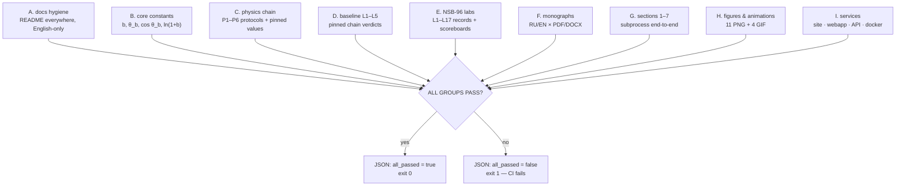

# `repo_integrity/` — the repository-wide integrity auditor

> **Navigation:** [repository root](../../README.md) › [verification](../README.md) › **`repo_integrity`**


---

This verifier answers one question mechanically: **does the whole
repository — every section, every folder — still confirm the claims it
publishes?** Where the per-section ports confirm the *mathematics*, this
auditor confirms the *repository*: that the documentation layer is
complete and English-only, that the pinned constants still recompute from
the closed forms, that every physics protocol exists with `ok = true`, that
the NSB-96 laboratory records and their scoreboards are in place, that the
monographs and papers are present in both languages and formats, that
sections 1–7 run end-to-end, and that the figure/animation sets and the
services are deployed where the READMEs say they are.

It is the top of the verification stack — everything else feeds it.



## The nine evidence groups

| Group | What is checked | Source of truth |
|---|---|---|
| **A. docs hygiene** | every directory carries a `README.md`; no Cyrillic in any README (the English-only policy) | the tree itself |
| **B. core constants** | `b`, `θ_b` (rad & deg), `cos θ_b`, `ln(1+b)` recomputed from the closed forms and matched against the pinned strings | `data/results/summary_numbers.json` |
| **C. physics chain** | the six P1–P6 protocols exist, carry `ok = true` and the expected criteria keys; the pinned headline values (factor `F`, `Nu`, P6 residual) re-match | `data/results/*.json` |
| **D. baseline L1–L5** | the five chain-verdict files exist; the L2 rotation-algebra record carries the recorded residuals | `data/results/baseline/` |
| **E. NSB-96 labs** | the lab records (`matrix112`, `smoke48`, `dns112`, `main96`, `bfamily96`, `bprotocol96`, `match`, the extra 11/12/13/16/17 runs and the Julia cross-check) exist; the aggregate scoreboards (`WIN 39 · DRAW 2 · LOSS 0`, L17 `WIN 13`) match the reports | `research_col_smar/results/results/`, `research_col_smar/reports/` |
| **F. monographs** | the two-language, two-format artifacts of the root monograph, the papers, the KdV chapter and the constants monograph are present and non-trivial (> 10 KB) | `monograph/`, `papers/`, `docs/`, `research_col_smar/monograph/` |
| **G. sections 1–7** | every section verifier runs end-to-end in a subprocess, parses as `all_passed = true`, exit code 0 | `verification/section*/python/verify.py` |
| **H. figures & animations** | the eleven academic figures and the four GIF animations exist at non-trivial sizes | `assets/figures/`, `assets/animations/` |
| **I. services** | the site, the web app, the API, the demos, the seven docker images, `MANIFEST.json`, `CITATION.cff`, the push script and the Termux guide are present | the tree itself |

## Run

```bash
make verify-repo                                   # the Makefile target
python3 verification/repo_integrity/verify_repo.py # direct
python3 verification/repo_integrity/verify_repo.py --fast   # skip the subprocess battery
```

Wall-clock: about one minute (group G dominates — it re-runs sections
1–7 for real). The output is the per-group `[PASS]`/`[FAIL]` battery, the
`COVERAGE MATRIX` table, and one final verdict line:

```text
JSON: {"verifier": "repo_integrity", "groups": 9, "all_passed": true}
REPOSITORY INTEGRITY: ALL GROUPS PASS
```

Exit code `0` iff every group passed — the CI hook, the release gate and
the dispute-protocol entry point all use this number.

## Relationship to the other layers

| Layer | Confirms | This auditor |
|---|---|---|
| section ports 1–7 | the mathematics of each section | re-runs them (group G) |
| `MANIFEST.json` + `make verify-manifest` | byte-level integrity of every file | complements it with *semantic* integrity |
| `check_readmes.py` | docs hygiene | re-checks it (group A) plus the rest |
| NSB-96 labs / reports | the physics at 96³/112³ | checks the records are where the reports say (group E) |

## Files

| File | Role |
|---|---|
| `verify_repo.py` | the auditor itself (stdlib-only, deterministic, ~400 lines) |
| `README.md` | this document |

## License

Part of **navier-stokes-b**, license IPL-RP-1.0 ([LICENSE.md](../../LICENSE.md)).
